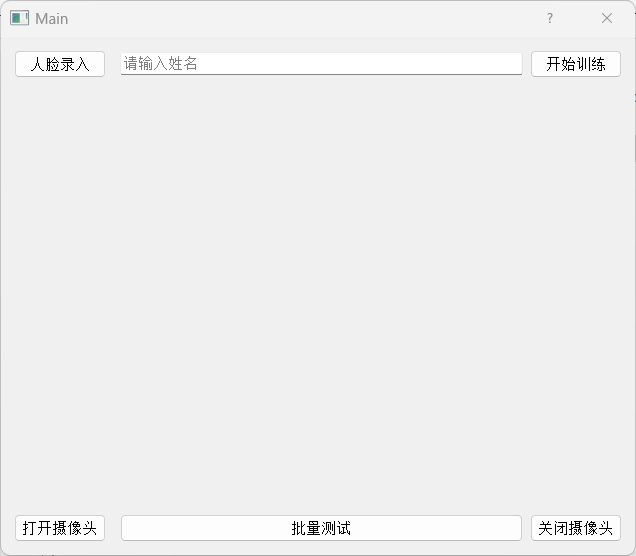

[TOC]


# 人脸识别应用

这是一个使用 Python 和 Face Recognition API 开发的实时人脸识别程序，具有实时识别摄像头中的人脸、批量识别图片中的人脸并导出识别结果等功能。此外，它还支持识别人脸关键点。通过使用 PyQt5 构建的简洁界面，用户可以方便地进行训练数据的导入、模型训练以及模型性能评估。应用程序经过 nuitka 编译，无需搭建环境便可在 Windows 平台上运行。



## 特性

- 实时识别摄像头中的人脸
- 批量识别图片中的人脸并导出识别结果
- 支持人脸关键点识别
- 支持用户导入训练数据进行模型训练
- 支持导入批量测试图片评估模型性能
- 使用简洁的 PyQt5 界面提高用户体验
- 编译为 Windows 平台的 .exe 文件，无需搭建环境便可运行

## 系统要求

- Windows 10 或更高版本
- Python 3.9（下载 .exe 版本则不需要 Python 环境）

## 安装

### 直接下载 .exe 文件运行

从 GitHub Releases 页面或者其他来源下载最新版本的 faceRecognize*.zip 文件，解压后找到demo.exe然后双击运行。

### 本地构建与运行（需要 Python 环境）

1. 克隆仓库并进入项目文件夹：

   ```
   git clone https://github.com/AngXue/deep-learn.git
   cd deep-learn
   ```

2. 安装依赖：

   参考 `env/lastF.yaml` 文件，使用 conda 创建虚拟环境并安装依赖：

   ```
   conda env create -f env/lastF.yaml
   ```

3. 运行应用程序：

   ```
   python demo.py
   ```

## 使用说明

1. 导入训练数据：将图片放置在`res/train`文件夹中，每个人的图片放在一个文件夹中，文件夹名即为人名。例如，将张三的图片放在`res/train/zhangsan`文件夹中，将李四的图片放在`res/train/lisi`文件夹中。
   
2. 训练模型：点击 `开始训练` 按钮，模型将根据导入的训练数据进行训练。

3. 进行实时人脸识别：点击 `打开摄像头` 按钮，程序将实时捕捉摄像头中的人脸并进行识别。

4. 批量识别图片并导出结果：点击 `批量测试` 按钮，测试图片放置在`res/testPhotos`目录中，文件命名为人名。识别完成后，结果将保存在应用程序所在目录的 `res/savePhotos` 文件夹中， 命名格式为`预测名.真实名.文件后缀`。

5. 评估模型性能：`批量测试`完成后会显示准确率、拒识率和用时。

## 版权和许可

本项目使用 [MIT License](LICENSE) 授权。
